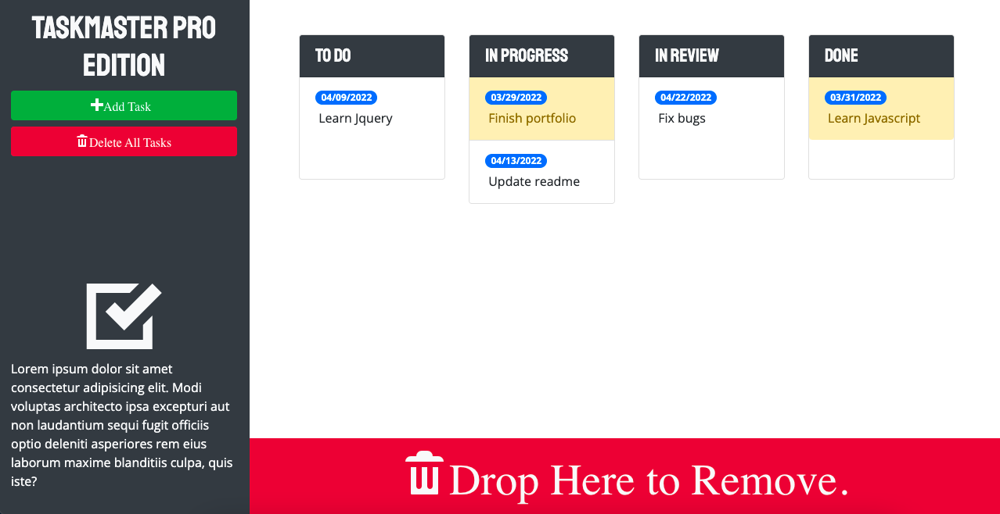

# taskmaster-pro

---
Taaskmaster-pro is a Kanban style task organizer optimized to run on all screen sizes. It uses local storage to store your tasks between sessions. It also automatically refreshes to update the task status.

## User Interface
<!-- {width: 100px;} -->

## Usage
You can create new tasks and delete all tasks by using the "Add Tasks" and "Delete All Tasks" buttons. Tasks can be dragged and dropped to reorder and/or delete. Dates and task names can be edited by clicking on them. Tasks will turn red when over due and yello when they are within two days of being due.

## Links to website and Github
[Password Generator](https://bagl0025.github.io/taskmaster-pro/)

[Github Repository](https://github.com/bagl0025/PasswordGenerator.git)

## Author
Brian Bagley

March 2022
